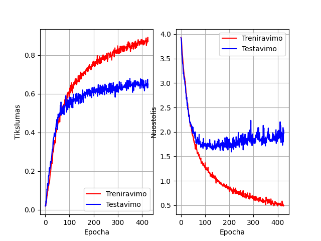
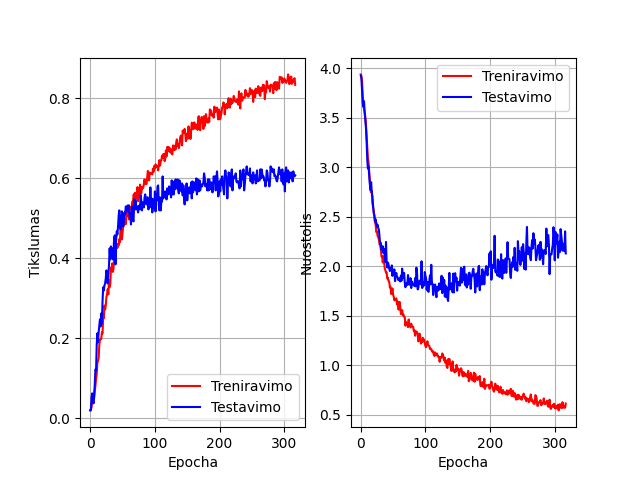
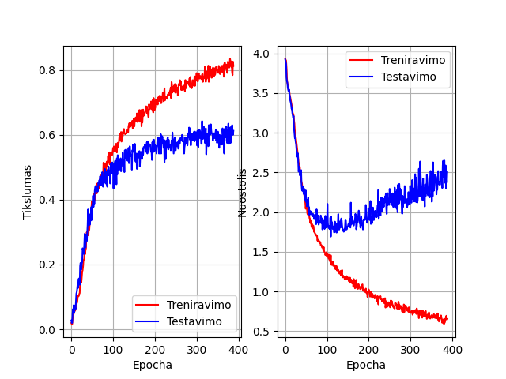
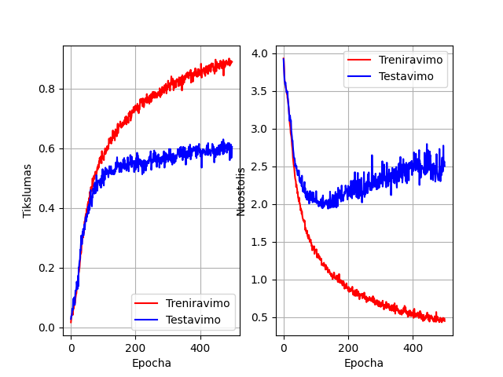
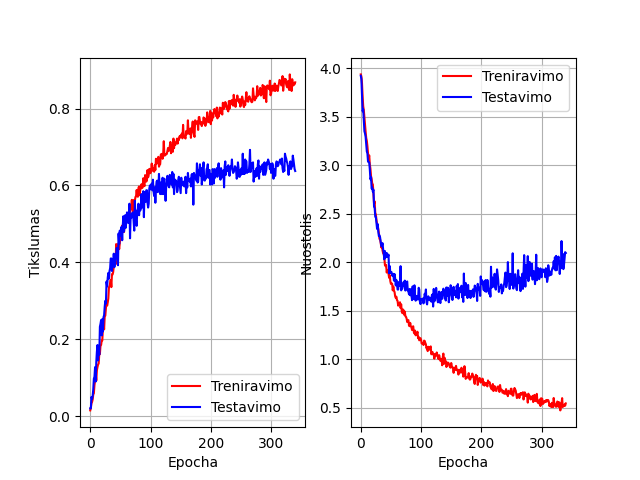

## TL;DR
Model can classify this dataset (compared to other papers), smooth one-hot encoding show significant better results, standard deviation of 5-fold cross validation is pretty low,

## Results of esc-50 classification:

Model       | Accuracy | Std Deviation
---         | ---      | ---
CNN - smooth| 73,4     | 1,07
CNN - crisp | 65,5     | 2,93
Human Accuracy | 81.30 | -
CNN -BaseLine (2015) |  64,5 | ~3
??CNN -BaseLine + batch norm (2017) *1 |  84,9     | -
CNN + Aug (2020) *2 | 88,65 | ?


*1 - https://openreview.net/pdf?id=B1Gi6LeRZ

*2 - https://arxiv.org/ftp/arxiv/papers/2007/2007.07966.pdf


----------------------------------------------------------------
## Model itself
```
def get_cnn(img_h, img_w, class_cnt):
    model = Sequential()
    
    alpha = 0.01

    # Layer 1
    model.add(Conv2D(filters=64, kernel_size=5, kernel_regularizer=regularizers.l2(1e-4), input_shape = (img_h, img_w, 1)))
    model.add(LeakyReLU(alpha))
    model.add(MaxPooling2D((3, 3), strides=3))
    model.add(Dropout(0.1))

    # Layer 2
    model.add(Conv2D(filters=128, kernel_size=4, kernel_regularizer=regularizers.l2(1e-4), padding='valid' ))
    model.add(LeakyReLU(alpha))
    model.add(MaxPooling2D((2, 2), strides=2 ))
    model.add(Dropout(0.25))


    # Layer 3
    model.add(Conv2D(filters=196, kernel_size=3, kernel_regularizer=regularizers.l2(1e-4),padding='valid' ))    
    model.add(LeakyReLU(alpha))
    model.add(MaxPooling2D((2, 2), strides=2 ))
    model.add(Dropout(0.5))

    # Fuly connected
    model.add(GlobalAveragePooling2D())
    
    # Layer 4
    model.add(Dense(128))
    model.add(LeakyReLU(alpha))
    model.add(Dropout(0.5))

    model.add(Dense(class_cnt, activation = "softmax"))
    
    opt = 'adam'
    model.compile(optimizer=opt, loss=keras.losses.CategoricalCrossentropy(label_smoothing=0.1), metrics=['accuracy'])
    return model
```


## Training graphs

Without smoothing encoding:












